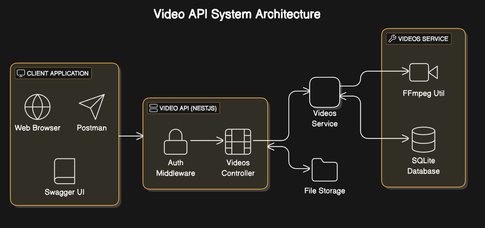

# 🎬 Video API - REST APIs for Video File Management

## 🚀 Overview

This project provides a robust and secure RESTful API designed for efficient video file management. It empowers users to perform key video operations like uploading, trimming, merging, and sharing video content, all while adhering to configurable limits and ensuring API security through API key-based authentication. Built with scalability and maintainability in mind, the API leverages the power of NestJS, TypeScript, TypeORM (with SQLite for simplicity), and FFmpeg for optimized video processing.

### ✨ Key Features

- **🔒 Secure API Endpoints:** Robust API key-based authentication safeguards all API endpoints, ensuring only authorized access.
- **📤 Flexible Video Upload Functionality:**
  - Supports uploading various video formats (optimally configured for MP4).
  - Enforces configurable maximum file size (e.g., `100MB`) and duration limits (e.g., `25 seconds`), easily adjustable via environment variables.
- **✂️ Precise Video Trimming:** Enables users to precisely trim video clips by specifying desired start and end times in seconds.
- **🧵 Seamless Video Merging:** Allows for the concatenation of multiple video clips (previously uploaded) into a single, cohesive video file.
- **🔗 Time-Limited Shareable Links:** Generates unique, time-expiring shareable links for video assets, enhancing controlled content distribution.
- **📖 Comprehensive API Documentation:** Fully documented API using Swagger UI, providing interactive exploration and testing capabilities, accessible at the `/api` endpoint after server startup.
- **🗄️ SQLite Database Integration:** Utilizes SQLite for straightforward data persistence. The database file (`db.sqlite`) is conveniently included within the repository, simplifying project setup.
- **🧪 Thorough Testing Suite:** Includes a comprehensive suite of unit and end-to-end tests, ensuring code reliability and API functionality. Test coverage reports are readily generated for in-depth analysis.

## 💡 Assumptions and Design Choices

- **🔑 Authentication Strategy:** Static API key authentication was implemented for this project as per the specified requirements, prioritizing simplicity for the task. However, for production environments, consider more advanced and secure methods like JWT or OAuth 2.0.
- **💾 Database Selection:** SQLite was chosen to facilitate ease of setup and project submission, embedding the database directly within the repository. Production deployments should leverage more scalable database systems such as PostgreSQL, MySQL, or cloud-managed database services.
- **🎞️ Video Processing Library:** FFmpeg is employed as the video processing engine for trimming and merging operations, under the assumption that FFmpeg is readily available within the server's execution environment.
- **📁 File Storage Mechanism:** Uploaded video files are stored locally within the `./storage` directory of the project. For production scenarios, employing cloud-based object storage solutions like AWS S3 or Google Cloud Storage is highly recommended for scalability and durability.
- **⚙️ Configurable Limits:** Video size and duration constraints, API keys, and share link expiry durations are managed through environment variables, loaded from a `.env` file, allowing for flexible configuration without code changes.

## 🛠️ Getting Started

### ✅ Prerequisites

- [Node.js](https://nodejs.org/) (Version >= 20 LTS Recommended, or the version used during development)
- [npm](https://www.npmjs.com/) (or [yarn](https://yarnpkg.com/)) package manager
- [FFmpeg](https://ffmpeg.org/) installed on your operating system (required for video processing features)

### ⚙️ Setup Instructions

1. **Clone the repository from GitHub:**

   ```bash
   git clone https://github.com/BhavsarDheeraj/video-api.git
   cd video-api
   ```

2. **Install project dependencies using npm:**

   ```bash
   npm install
   ```

3. **Environment Configuration (Optional - Customize API Settings):**

   - Create a `.env` file in the root directory of the project if one doesn't exist.
   - To customize API settings, define the following environment variables within the `.env` file. Example `.env` configuration:

     ```
     PORT=3000
     API_KEY='your-secret-api-key' # Replace with your desired API key
     MAX_SIZE_IN_MB=100          # Maximum video file size in MB
     MAX_DURATION_IN_SECONDS=25  # Maximum video duration in seconds
     SHARE_EXPIRY_TIME=86400     # Share link expiry time in seconds (e.g., 24 hours)
     ```

     - If a `.env` file is not present, the API will utilize default values as defined within the `ConfigModule` configuration.

### ▶️ Running the API Server

To start the development server, execute the following command in your terminal:

```bash
npm run start:dev
```

- The API server will be accessible at `http://localhost:3000` (or the custom port specified in your `.env` file).
- Access the interactive Swagger UI API documentation by navigating to `http://localhost:3000/api` in your web browser.

### 🧪 Running the Test Suite

Execute the following command to run the complete test suite, including both unit and end-to-end tests, and generate a test coverage report:

```bash
npm run test:cov
```

- Detailed test coverage reports will be generated and available in the `coverage/` directory after test execution.
- For running only unit tests: `npm run test`
- For running only end-to-end tests: `npm run test:e2e`

### 🔑 API Key Authentication

- API key-based authentication secures all API endpoints, with the exception of the `/videos/shared/{token}` endpoint, which is designed for public access via shareable links.
- To authenticate API requests, include the `x-api-key` header in your HTTP requests.
- Example using `curl` to upload a video (replace placeholders with your actual API key and video file path):

  ```bash
  curl -X POST http://localhost:3000/videos/upload \
       -H "Content-Type: multipart/form-data" \
       -H "x-api-key: your-secret-api-key" \
       -F "file=@/path/to/your/video.mp4"
  ```

## 🗂️ API Endpoints

| Endpoint                     | Method | Request Body                   | Response Codes                                                | Description                                                                 |
| :--------------------------- | :----- | :----------------------------- | :------------------------------------------------------------ | :-------------------------------------------------------------------------- |
| `POST /videos/upload`        | POST   | `multipart/form-data` (`file`) | 201 Created, 400 Bad Request, 401 Unauthorized                | Upload a new video file to the server.                                      |
| `POST /videos/trim`          | POST   | `TrimVideoDto` (JSON)          | 201 Created, 400 Bad Request, 404 Not Found, 401 Unauthorized | Trim an existing video clip by specifying start and end times.              |
| `POST /videos/merge`         | POST   | `MergeVideosDto` (JSON)        | 201 Created, 400 Bad Request, 404 Not Found, 401 Unauthorized | Merge multiple previously uploaded video clips into a single video.         |
| `POST /videos/share`         | POST   | `ShareVideoDto` (JSON)         | 201 Created, 400 Bad Request, 404 Not Found, 401 Unauthorized | Generate a time-expiring shareable link for a specific video.               |
| `GET /videos/shared/{token}` | GET    | None                           | 200 OK, 404 Not Found, 401 Unauthorized                       | Retrieve and stream a shared video using a valid and unexpired share token. |

## 📚 Documentation and Citations

- **NestJS Official Documentation:** [https://docs.nestjs.com/](https://docs.nestjs.com/) - _Comprehensive documentation for the NestJS framework._
- **TypeORM Official Documentation:** [https://typeorm.io/](https://typeorm.io/) - _Documentation for the TypeORM Object-Relational Mapper._
- **Fluent-FFmpeg npm Package:** [https://www.npmjs.com/package/fluent-ffmpeg](https://www.npmjs.com/package/fluent-ffmpeg) - _Node.js library for fluent FFmpeg command-line interface._
- **class-validator and class-transformer (GitHub Repository):** [https://github.com/typestack/class-validator](https://github.com/typestack/class-validator) - _Validation and transformation library for TypeScript classes, used for DTO validation._

## 📜 Commit History

- The project's development history is meticulously maintained with granular, well-commented commits, reflecting a step-by-step approach to feature implementation and code refactoring, ensuring clarity and traceability.

## 🏛️ Architecture Diagram


